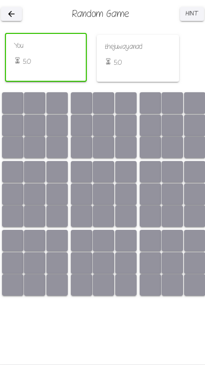

## Ultimate Tic Tac Toe - Server 
A simple board game for users
A Django project that uses REST api, Websockets, PostgreSQL and Redis
### Setup
- create a virtual environment `python3 -m venv env`
- run command `source env/bin/activate`
- Install all dependencies `pip install -r requirements.txt`
- Install redis-server (refer [how to install redis-server](https://www.digitalocean.com/community/tutorials/how-to-install-and-secure-redis-on-ubuntu-18-04))
- Install PostgresSQL (refer [install postgresSQL](https://www.postgresql.org/download/linux/ubuntu/))
- run command `python3 manage.py runserver` and the server should be available at localhost with port 8000

### Technologies Used
- **DjangoRestFramework** - Serves as a python backend framework. Creates api endpoints that can be called from anywhere
- ** Websockets** - To send real time messages such as game movements
- **PostgreSQL** - Used as DB to store different datas
- **Redis** - Used as message broker, high throughput
- **Docker** -  As a container technology

### Results

